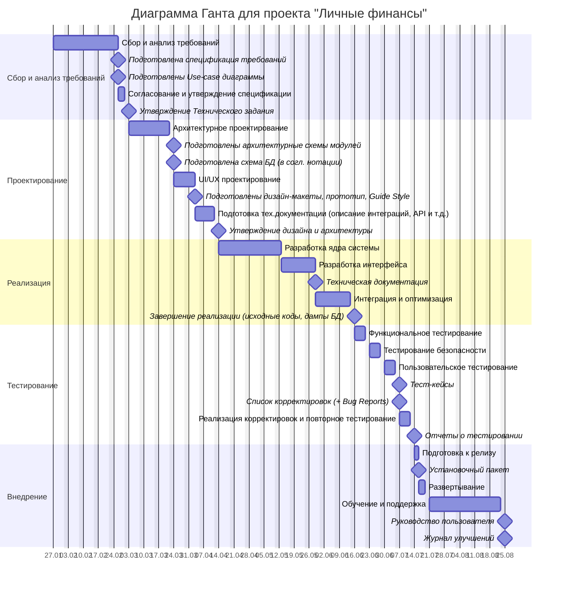

# Проект "Личные финансы"
##### (Менеджер личного/семейного бюджета)

## 1. Легенда проекта

### Описание проекта
"Личные финансы" — это десктопное приложение для планирования и учета личного/семейного бюджета, позволяющее пользователям эффективно управлять личными финансами, фиксировать доходы и расходы, создавать финансовые цели и анализировать финансовые потоки.

### Задачи
- Учет ежедневных доходов и расходов с возможностью делать заметки
- Учет регулярных расходов и поступлений в различных валютах
- Категоризация финансовых операций с гибкой системой тегов
- Создание и ведение бюджетов в разрезе категорий
- Визуализация финансовой статистики с интерактивными графиками
- Планирование крупных покупок с учетом накоплений
- Кредитный калькулятор с расчетом графика платежей
- Экспорт финансовых отчетов в различных форматах
- Система шифрования и защиты финансовых данных
- Резервное копирование данных

## 2. Требования проекта

### Срок реализации проекта
- Общая продолжительность: 30 недель
- Дата начала: 27.01.2025
- Дата завершения: 25.08.2025

### Команда проекта (5 человек)
- Проектный менеджер (1)
- Frontend-разработчик (1)
- Backend-разработчик (1)
- UI/UX дизайнер (1)
- QA инженер (1)

### Характеристики проекта
- Автономное desktop-приложение
- Локальное хранение данных
- Высокие требования к безопасности финансовой информации
- Необходимость простого и понятного интерфейса
- Тегирование и заметки по финансовым операциям
- Поиск и группировка данных по тегам
- Точность финансовых расчетов

## 3. Этапы проекта

### Этап 1: Сбор и анализ требований (5 недель)
**Сбор требований включает:**
- Проведение интервью с потенциальными пользователями для понимания их финансовых привычек
- Анализ существующих решений для управления семейным бюджетом
- Определение ключевых финансовых операций и категорий расходов и доходов/поступлений
- Выявление требований к безопасности финансовых данных
- Разработка концепции системы тегов и заметок для удобной организации финансовых данных
- Формирование списка необходимых финансовых отчетов

**Документация требований:**
- Создание детальных use-case сценариев для всех финансовых операций
- Разработка спецификаций для каждого модуля (доходы, расходы, бюджеты, калькулятор, система тегов и заметок, отчеты)
- Определение правил валидации финансовых данных
- Формирование требований к точности расчетов
- Создание глоссария финансовых терминов

**Согласование и утверждение:**
- Презентация требований заинтересованным сторонам
- Уточнение формул финансовых расчетов
- Согласование форматов хранения денежных значений
- Утверждение списка поддерживаемых валют
- Доработка и финализация технического задания

### 2. Проектирование (6 недель)

**Архитектурное проектирование:**
- Разработка архитектуры приложения с учетом требований к безопасности финансовых данных
- Проектирование структуры базы данных для хранения транзакций
- Создание схемы модулей (управление транзакциями, категориями, бюджетами, калькулятор, система тегов, система отчетов)
- Определение механизмов резервного копирования данных
- Проектирование системы шифрования конфиденциальной информации

**UI/UX проектирование:**
- Создание прототипов основных экранов (dashboard, транзакции, отчеты)
- Разработка системы визуализации финансовых данных
- Проектирование интерфейсов ввода финансовой информации
- Создание макетов графиков и диаграмм
- Проработка навигации между разделами

**Техническая документация:**
- Создание схемы базы данных
- Описание API внутренних модулей
- Документирование алгоритмов финансовых расчетов
- Разработка стандартов форматирования денежных значений (в т.ч. для разных валют)
- Создание guide style интерфейса приложения

### 3. Реализация (9 недель)

**Разработка ядра системы:**
- Создание базы данных для хранения финансовой информации
 -Реализация основных классов для работы с транзакциями
- Реализация системы тегирования финансовых операций
- Разработка системы категоризации расходов и доходов
- Имплементация механизмов валидации финансовых данных
- Реализация алгоритмов финансовых расчетов
- Разработка модуля мультивалютных операций
- Создание кредитного калькулятора с поддержкой разных валют
- Реализация конвертации валют и курсов обмена

**Разработка интерфейса:**
- Создание основных экранов приложения
- Реализация форм ввода финансовых данных
- Разработка компонентов визуализации (графики, диаграммы)
- Имплементация системы фильтрации и поиска
- Создание интерфейса формирования отчетов
- Разработка интерфейса управления тегами и заметками
- Создание панели кредитного калькулятора
- Реализация интерфейса работы с разными валютами

**Интеграция и оптимизация:**
- Объединение модулей управления финансами
- Настройка системы резервного копирования
- Оптимизация производительности финансовых расчетов
- Внедрение механизмов экспорта данных
- Интеграция системы тегов со всеми модулями
- Оптимизация работы с мультивалютными операциями
- Интеграция кредитного калькулятора с основными модулями

### 4. Тестирование (4 недели)

**Функциональное тестирование:**
- Проверка точности финансовых расчетов
- Тестирование операций с разными валютами
- Верификация работы фильтров и категорий
- Проверка формирования отчетов
- Тестирование импорта/экспорта данных
- Тестирование кредитного калькулятора
- Проверка конвертации валют и расчетов
- Тестирование системы тегов и поиска/группировки по тегам

**Тестирование безопасности:**
- Проверка шифрования финансовых данных
- Тестирование механизмов резервного копирования
- Аудит безопасности хранения данных
- Проверка валидации вводимых данных
- Тестирование разграничения доступа

**Пользовательское тестирование:**
- Проверка удобства ввода финансовой информации
- Тестирование понятности интерфейса
- Верификация корректности отображения данных
- Проверка удобства навигации
- Проверка работы с тегами и заметками
- Тестирование удобства работы с разными валютами
- Оценка кредитного калькулятора

### 5. Внедрение (6 недель)

**Подготовка к релизу:**
- Создание установочного пакета приложения
- Подготовка инструкций по установке
- Разработка руководства пользователя
- Создание обучающих материалов
- Настройка системы обновлений

**Развертывание:**
- Финальное тестирование установки
- Проверка целостности данных при установке
- Тестирование процесса обновления
- Верификация работы резервного копирования

**Поддержка:**
- Мониторинг работы приложения
- Сбор обратной связи от первых пользователей
- Исправление выявленных проблем
- Подготовка обновлений
- Техническая поддержка пользователей

## 4. Артефакты каждого этапа

| Этап | Продолжительность | Ключевые артефакты |
|------|-------------------|-------------------|
| Сбор и анализ требований | 5 недель | - Спецификация требований - Use-case диаграммы - Техническое задание |
| Проектирование | 6 недель | - Схема архитектуры - Дизайн-макеты - Схема базы данных |
| Реализация | 9 недель | - Исходный код - База данных - Техническая документация |
| Тестирование | 4 недели | - Тест-кейсы - Отчеты о тестировании - Список корректировок |
| Внедрение | 6 недель | - Установочный пакет - Руководство пользователя - Журнал улучшений |

## 5. Диаграмма Ганта

