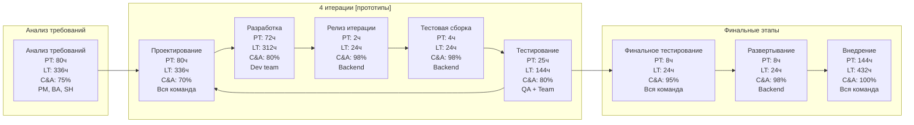

# Отчет об анализе текущего процесса разработки
## Проект "Личные финансы"

### 1. Общая информация о проекте

**Тема проекта:** Разработка десктопного приложения для планирования и учета личного/семейного бюджета

**Основная задача:** Создание удобного инструмента для эффективного управления личными финансами с возможностями:
- Учета доходов/расходов
- Планирования бюджета
- Анализа финансовых потоков

**Особенности проекта:**
- Автономное desktop-приложение
- Локальное хранение данных
- Высокие требования к безопасности
- Необходимость простого интерфейса
- Система тегирования операций
- Требования к точности расчетов

#### Функциональные требования

**Критически важные (Critical):**
- Учет ежедневных доходов и расходов
- Система шифрования данных
- Категоризация операций
- Создание и ведение бюджетов
- Локальное хранение данных

**Важные (Normal):**
- Планирование крупных покупок
- Мультивалютный учет
- Система тегов и заметок
- Расширенная аналитика
- Визуализация статистики

**Желательные (Low):**
- Кредитный калькулятор
- Экспорт данных
- Резервное копирование
- Дополнительная визуализация

#### Краткое описание этапов

**Подготовительный этап (2 недели):**
- Анализ бизнес-целей
- Определение стейкхолдеров
- Сбор и анализ требований
- Приоритизация
- Создание спецификации
- Согласование требований

**Основной этап (20 недель):**
4 итерации по 5 недель каждая, включающие:
- Проектирование (архитектура, прототипы, макеты) (2 недели)
- Построение (разработка кода) (2 недели)
- Демонстрация/Тестирование (презентация, тестирование и фидбек) (1 неделя)

**Этап внедрения (4 недели):**
- Финальное тестирование
- Развертывание
- Обучение пользователей
- Настройка поддержки
- Запуск мониторинга

#### Детальное описание итераций этапа разработки

**Итерация 1 - MVP (25 дней)**
*Ключевой аспект:* Базовый функционал учета и безопасность
- Проектирование: DB, UI, тех.спецификации
- Разработка: модуль транзакций, категории, шифрование, баз. чарты и диаграммы (4)
- Тестирование: Smoke + Regression, пользовательское тестирование, обратная связь

**Итерация 2 - Планирование (25 дней)**
*Ключевой аспект:* Бюджетирование и дополнительные функции
- Проектирование: модуль бюджетирования, теги, мультивалютность
- Разработка: реализация спроектированных модулей (3)
- Тестирование: Smoke + Regression, функциональное и пользовательское

**Итерация 3 - Аналитика (25 дней)**
*Ключевой аспект:* Аналитические функции и безопасность данных
- Проектирование: планирование покупок, аналитика, бэкапы и экспорт
- Разработка: реализация спроектированных модулей + доп. чарты и диаграммы (5)
- Тестирование: Smoke + Regression, комплексное тестирование функций

**Итерация 4 - Доработка (25 дней)**
*Ключевой аспект:* Дополнительный функционал и оптимизация
- Проектирование: кредитный калькулятор, оптимизация, UI
- Разработка: реализация улучшений + калькулятор
- Тестирование: Smoke + Regression, интеграционное и финальное

### Возможные проблемные зоны

- **Структурные проблемы:**
   - Длительные циклы проектирования (2 недели на итерацию)
   - Последовательное выполнение этапов внутри итерации
   - Отсутствие параллельной разработки отдельных модулей
   - Жесткое последовательное разделение на фазы внутри итерации

- **Проблемы планирования:**
   - Крупные функциональные блоки в итерациях
   - Неравномерное распределение нагрузки между итерациями
   - Отсутствие гибкости в планировании
   - Сложность внесения изменений в план

- **Проблемы процесса:**
   - Относительно долгая обратная связь от пользователей (только в конце итерации)
   - Риски позднего обнаружения проблем
   - Сложность корректировки плана внутри итерации
   - Большой объем документации перед началом разработки

- **Технические проблемы:**
   - Риски при интеграциях модулей между собой из-за их параллельной разработки
   - Сложность оценки времени на большие блоки/модули
   - Потенциальные проблемы с зависимостями между модулями

### 2. Визуализация текущего потока работы с помощью метода Value Stream Mapping

#### Описание процессов

| Этап | Описание | Длительность | Участники |
|--------------------|--------------------------------------------------------------------------|---------------------------|-----------------------------------------|
| 1. Анализ требований | Сбор, анализ и согласование требований, приоритизация фич. Итог — спецификация | 2 недели (10 раб.дн.) | Проектный менеджер, бизнес-аналитик, стейкхолдеры |
| 2. Проектирование | Обсуждение и детализация реализации требований из спецификации. Включает работу над архитектурой и прототипами | 2 недели (10 раб.дн.) на итерацию | Вся команда |
| 3. Разработка | Реализация задач по заранее утверждённым прототипам. Параллельная работа frontend и backend разработчиков | 2 недели (9 раб.дн.) на итерацию | Frontend, Backend |
| 4. Релиз итерации | Мерж фич в релизную ветку GitHub | 1 раб. день | Backend |
| 5. Тестовая сборка | Сбор проекта backend-разработчиком, деплой на тестовый сервер | 1 день (из срока этапа тестирования) | Backend |
| 6. Тестирование | Ручное и автоматизированное тестирование: Smoke, Sanity, регрессионное и функциональное. Исправление найденных дефектов (плановый показатель 20% задач итерации) | 1 неделя (4 раб.дн.) на итерацию | QA инженер, Backend / Вся команда (доработки) |
| 7. Финальное тестирование | E2E тестирование | До 1 дня | Вся команда |
| 8. Развертывание | Сбор проекта backend-разработчиком, деплой на продуктовый сервер | 1 день | Backend |
| 9. Внедрение | Обучение пользователей, поддержка, мониторинг, сбор обратной связи | 18 рабочих дней | Вся команда |

#### Метрики Development Value Stream

| Этап | PT (Process Time) | LT (Lead Time) | %C&A (Percent Complete and Accurate) |
|--------------------|--------------------------------------------------------------------------|---------------------------|-----------------------------------------|
| Анализ требований | 80 часов | 336 часов | 75% |
|Итеративная разработка |(4 итерации)|||
| * Проектирование | 80 часов | 336 часов | 70% |
| * Разработка | 72 часа | 312 часов | 80% |
| * Релиз итерации | 2 часов | 24 часа | 98% |
| * Тестовая сборка | 4 часов | 24 часа | 98% |
| * Тестирование (-20% на доработки) | 25 часов | 144 часов | 80% |
|||||
| Финальное тестирование | 8 часов | 24 часов | 95% |
| Развертывание | 8 часов | 24 часа | 98% |
| Внедрение | 144 часа | 432 часа | 100% |

**Итоги расчета:** 
Total Process Time: 1012 часов 
Total Lead Time:  4176 часов 
Activity Ratio:  ≈ 24.2% 
Rolled of Percent Complete and Accurate (%C&A):
<pre>75% * 70% * 80% * 98% * 98% * 80% * 95% * 98% * 100% ≈ 30%</pre>

#### Выявленные узкие места (bottlenecks)
1. Высокие затраты времени на проектирование (40 раб.дней):
  - Весь процесс выполняется последовательно, что создаёт узкое место
2. Большие интервалы между демонстрациями (5 недель):
  - Долгая обратная связь от пользователей (только в конце итерации)
3. Низкий процент задач без доработок (%C&A):
  - На тестировании выявляется до 20% дефектов
4. Длительное тестирование (LT = 17 раб.дней) и слабая автоматизация:
  - Процесс тестирования (в т.ч. ручного) занимает значительное время
5. Доработки и интеграция:
  - Риски возникновения проблем при интеграции задач в конце итерации
	
Текущий процесс разработки, хотя и структурирован, имеет ряд существенных ограничений, характерных для методологии RAD. Основные проблемы связаны с длительными циклами проектирования, жестким разделением фаз и отсутствием гибкости в планировании. Это создает риски для проекта и может затруднить быстрое реагирование на изменения требований или обратную связь от пользователей.

### 3. Анализ проблемы методом Five Whys
**Проблема:** Большие интервалы между демонстрациями (5 недель)

**Почему большие интервалы между демонстрациями (5 недель)?**
 - Потому что демонстрации продукта запланированы только в конце каждой итерации.
	-	**Почему демонстрации продукта запланированы только в конце итерации?**
		- Потому что команда выполняет полный цикл разработки прототипа (проектирование, реализация, тестирование) перед демонстрацией, а итерация занимает 5 недель.
			- **Почему цикл разработки занимает 5 недель?**
				- Потому что все этапы разработки выполняются внутри итерации последовательно, без промежуточных проверок или обратной связи.
					- **Почему нет промежуточных проверок или обратной связи?**
						- Потому что процесс работы не предусматривает промежуточных демонстраций или инкрементального подхода, где готовые части продукта могли бы демонстрироваться раньше.
							- **Почему процесс не предусматривает промежуточных демонстраций?**
								- Потому что команда не внедряла практики Agile, где используется более частая демонстрация инкрементов, и здесь процесс нацелен на полное завершение итерации перед предоставлением результата.
 
**Корневая причина:**
Процесс разработки ориентирован на последовательное завершение полного цикла (итерации), что исключает возможность частой демонстрации готовых частей продукта и получения обратной связи на ранних этапах.

### [4. Fishbone Diagram анализа проблем длительных интервалов между демонстрациями](https://web.mindonmap.com/app/viewer-ZTJRMTc4ZVExNzMy)

### 5.  Предложения по улучшению процесса разработки

Анализ показал, что корневой причиной проблемы длительных интервалов между демонстрациями является подход "все или ничего" при разработке функционала. Это приводит к тому, что мы не можем показывать промежуточные результаты работы и получать раннюю обратную связь.

Ключевые улучшения направлены на:
* Разделение задач итерации на более мелкие инкременты
* Увеличение частоты демонстраций
* Автоматизацию процесса доставки изменений
* Уменьшение времени тестирования и доработок за счёт внедрения автоматизированного тестирования

##### 1. Изменения в планировании
- Переход на двухнедельные спринты вместо 5-недельных итераций
- Разбивка крупных user stories на более мелкие
- Внедрение концепции Minimal Marketable Feature (MMF)

##### 2. Технические улучшения
- Внедрение CI/CD пайплайна
- Реализация системы feature flags
- Автоматизация процесса деплоя на тестовые среды

##### 3. Процессные изменения
- Внедрение ежедневных демо-сессий для команды
- Еженедельные демонстрации для стейкхолдеров
- Создание песочницы для раннего тестирования функционала

##### 4. Работа с пользователями
- Формирование фокус-группы для регулярного тестирования
- Организация системы непрерывной обратной связи
- Внедрение A/B тестирования новых функций

### 6. План действий по внедрению улучшений

#### Подготовка к изменениям (2 недели)

##### Неделя 1: Анализ и планирование
**Ответственный:** Project Manager
1. Провести декомпозицию текущих user stories
    - Срок: 3 дня
    - Исполнители: Product Owner, Tech Lead, Business Analyst
    - Результат: Бэклог с user stories размером не более 3 story points
    - Критерии: 100% stories соответствуют INVEST-критериям

2. Разработать регламент спринтов
    - Срок: 2 дня
    - Исполнители: Scrum Master, Tech Lead
    - Результат: Документированный процесс планирования и проведения двухнедельных спринтов
    - Критерии: Регламент содержит все церемонии, роли, артефакты и метрики

##### Неделя 2: Техническая подготовка
**Ответственный:** Tech Lead
1. Внедрить CI/CD pipeline
    - Срок: 3 дня
    - Исполнители: DevOps Engineer, Backend Team
    - Результат: Автоматизированный процесс сборки и деплоя
    - Критерии: Время от коммита до деплоя не более 15 минут

2. Настроить систему feature flags
    - Срок: 2 дня
    - Исполнители: Backend Team
    - Результат: Внедренная система управления фичами
    - Критерии: Возможность включения/выключения любой новой функции без деплоя

#### Внедрение изменений (2 недели)

##### Неделя 3: Организационные изменения
**Ответственный:** Scrum Master
1. Внедрить ежедневные демо
    - Срок: 3 дня
    - Исполнители: Development Team
    - Результат: Настроенный процесс ежедневных демонстраций
    - Критерии: 15-минутные демо-сессии после daily standup

2. Организовать систему быстрой обратной связи
    - Срок: 2 дня
    - Исполнители: Product Owner, Business Analyst
    - Результат: Работающий процесс сбора и обработки фидбека
    - Критерии: Время от получения фидбека до внесения в бэклог не более 4 часов

##### Неделя 4: Пилотирование
**Ответственный:** Project Manager
1. Запустить пилотный спринт
    - Срок: 5 дней
    - Исполнители: Вся команда
    - Результат: Завершенный двухнедельный спринт по новому процессу
    - Критерии: Минимум 5 успешных ежедневных демо

#### Стабилизация (2 недели)

##### Неделя 5: Анализ результатов
**Ответственный:** Product Owner
1. Провести оценку эффективности
    - Срок: 5 дней
    - Исполнители: Scrum Master, Tech Lead
    - Результат: Отчет по ключевым метрикам
    - Критерии: Собраны все метрики из раздела KPI

##### Неделя 6: Масштабирование
**Ответственный:** Project Manager
1. Масштабировать процесс
    - Срок: 5 дней
    - Исполнители: Все команды проекта
    - Результат: Новый процесс внедрен во всех командах
    - Критерии: 100% команд проводят ежедневные демо

### Ожидаемые результаты (KPI)

1. Время цикла обратной связи
    - Базовое: 5 недель
    - Целевое: 1 день
    - Измерение: еженедельно

2. Частота демонстраций
    - Базовое: 1 раз в 5 недель
    - Целевое: 5 раз в неделю
    - Измерение: еженедельно

3. Процент доработок после релиза
    - Базовое: 40%
    - Целевое: ≤10%
    - Измерение: каждый спринт

### Риски и их снижение

1. Риск: Снижение производительности команды
    - Вероятность: Высокая
    - Влияние: Среднее
    - Митигация: Уменьшение плановой velocity на 20% в первые два спринта
    - Ответственный: Scrum Master

2. Риск: Технические проблемы с CI/CD
    - Вероятность: Средняя
    - Влияние: Высокое
    - Митигация: Выделение выделенного DevOps-инженера на время внедрения
    - Ответственный: Tech Lead

3. Риск: Сопротивление изменениям
    - Вероятность: Средняя
    - Влияние: Высокое
    - Митигация: Предварительные обучающие сессии и демонстрация выгод
    - Ответственный: Project Manager
	
4. Риск: Изменение состава команды
	- Вероятность: Высокая
	- Влияние: Критическое
	- Целевой состав и роли (7 человек):
		- Проектный менеджер / Scrum Master (1) - расширение существующей роли
		- Frontend-разработчик (1) - без изменений
		- Backend-разработчик (1) - без изменений
		- UI/UX дизайнер / Product Owner (1) - расширение роли
		- QA инженер / QA автоматизатор (1) - развитие существующего специалиста
		- DevOps инженер (1) - новая позиция
		- Дополнительный разработчик (Full-stack) (1) - новая позиция
	- Митигация:
		- Краткосрочные меры (1-2 месяца):
			- Обучение текущего PM практикам Scrum-мастера
			- Обучение UI/UX дизайнера основам product ownership
			- Тренинги по автоматизации тестирования для QA инженера
			- Временное привлечение внешнего DevOps консультанта (part-time)
		- Среднесрочные меры (2-4 месяца):
			- Наём DevOps инженера и Full-stack разработчика
			- Создание программы адаптации для новых сотрудников
			- Постепенная передача знаний от внешнего DevOps консультанта
		- Снижение рисков:
			- Уменьшение velocity на 20% в первые два спринта
			- Выделение 20% времени существующей команды на обучение новым ролям
			- Документирование всех процессов и создание базы знаний
			- Кросс-обучение внутри команды для снижения bus factor
	- Ответственный: Project Manager
